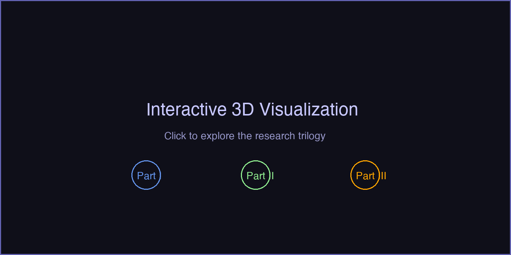
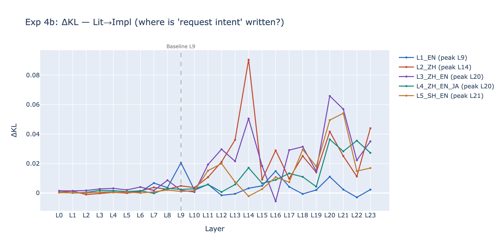
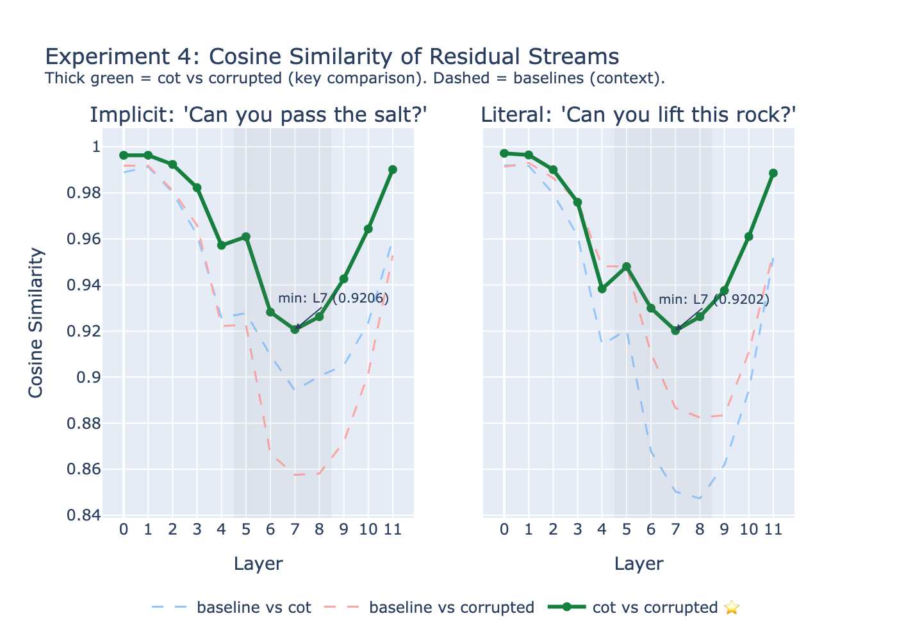
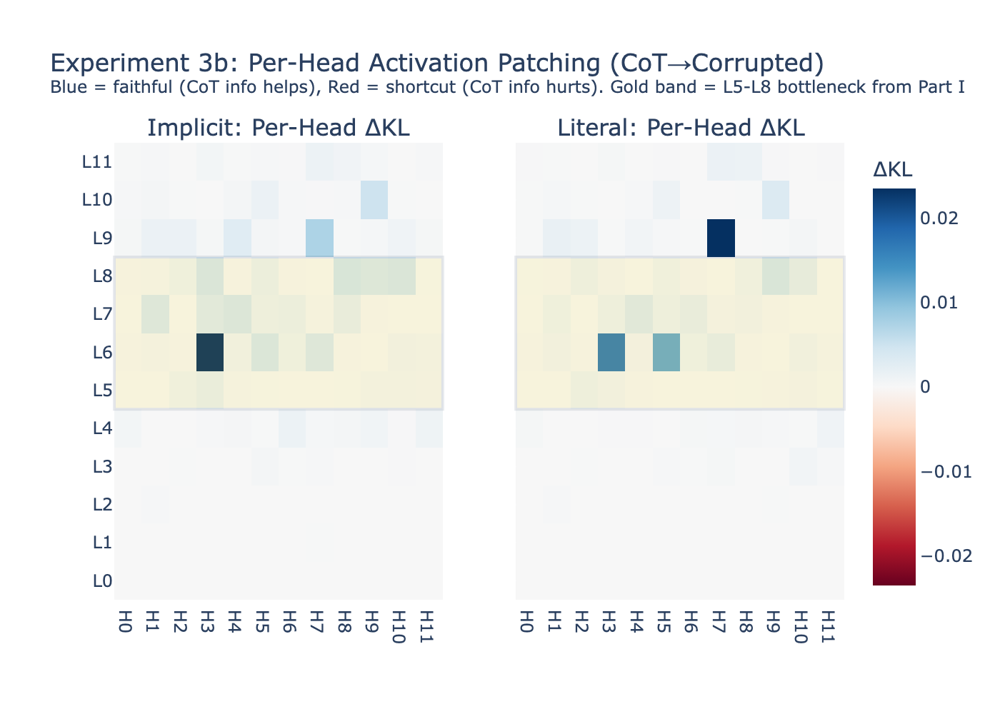

# How Do Language Models Understand What You *Really* Mean?

**A mechanistic interpretability study of pragmatic reasoning, multilingual processing, and chain-of-thought faithfulness in transformer language models.**

Sole author. Built with [TransformerLens](https://github.com/neelnanda-io/TransformerLens).

<!-- Interactive 3D visualization: open trilogy_viz.html in a browser -->
<p align="center">
  <a href="trilogy_viz.html">
    
  </a>
  <br/>
  <em>↑ Open <code>trilogy_viz.html</code> for the interactive 3D demo</em>
</p>

---

## The Question

When someone says *"Can you pass the salt?"*, no one answers *"Yes, I can"* and sits there. Humans instantly recognize this as a request, not a question about ability. But what happens inside a language model? Does it learn this distinction? Where? And can we trust its explanation of *how* it understood you?

This repository investigates these questions through three connected studies, each building on the findings of the last:

```
Part I:   Does the model distinguish implicit from literal meaning?
            → Yes. Layers 5–8 (GPT-2), layers 9/20 (BLOOM).

Part II:  Does this still work when the input mixes multiple languages?
            → Half yes, half no. The "ability question" detector is language-agnostic.
              The "request intent" detector shifts rightward under code-switching.

Part III: When the model "explains" its understanding, is the explanation real?
            → Partially. The implicit sentence's CoT is FAITHFUL (causally changes the
              answer). The literal sentence shows SELF-REPAIR (bottleneck detects the
              corruption, but downstream layers compensate). Zero shortcut circuits found
              — unlike arithmetic tasks, the model doesn't need to bypass the reasoning
              chain for a task it can genuinely perform.
```

---

## Part I — Implicit vs. Literal Meaning

**Status: Complete** · `experiment.ipynb` (GPT-2) · `experiment_bloom_baseline.ipynb` (BLOOM replication)

**Setup.** Six pairs of sentences with identical syntactic structure ("Can you + verb + object + ?") but different pragmatic intent:

| Implicit (request) | Literal (ability question) |
|---|---|
| *Can you pass the salt?* | *Can you lift this rock?* |
| *Can you close the window?* | *Can you touch the ceiling?* |
| ... | ... |

**Method.** Five experiments using GPT-2 Small (124M parameters):

1. **Logit lens** — project each layer's residual stream into vocabulary space to see what the model "believes" at each stage of processing
2. **Probe token tracking** — track P("Yes"), P("Sure"), P("No") and other response tokens layer by layer
3. **Attention pattern analysis** — visualize what the final token attends to at each layer
4. **Cosine similarity** — measure representational divergence between implicit and literal sentences across layers
5. **Activation patching** — replace one sentence's activations with the other's at each layer to identify causal bottlenecks

**Key Findings.**

- **Pragmatic divergence emerges in layers 5–8.** Early layers (0–4) treat both sentence types identically. Starting at layer 5, literal questions shift toward Yes/No response tokens while implicit requests do not — they produce tokens consistent with action or compliance ("Sure", "Please").


- **Layer 5 is a causal bottleneck.** Activation patching produces the largest behavioral shift when applied at layer 5, confirming it as the critical transition point for the implicit/literal distinction.


- **Representations diverge then reconverge.** Cosine similarity between implicit and literal residual streams drops from ~0.99 (layer 0) to ~0.88 (layers 6–8), then recovers. This U-shaped pattern is consistent across all sentence pairs.

**BLOOM-560m Replication.** Key differences from GPT-2:

| | GPT-2 Small | BLOOM-560m |
|---|---|---|
| **Bottleneck** | Single: L5 | Asymmetric: **L9** (request intent) / **L20** (ability intent) |
| **Cosine dip** | L6–L8 (narrow) | L6–L19 (wide, minimum at L14) |
| **Pattern** | Localized | Two-stage: different intents encoded at different layers |

**Limitations.** Small model (124M/560M), small dataset (6 pairs), potential lexical confounds between sentence pairs, mean attention averaging dilutes head-specific effects.

---

## Part II — Multilingual Code-Switching

**Status: Complete** · `experiment_multilingual.ipynb`

**Motivation.** Part I establishes that layers 5–8 (GPT-2) / L9+L20 (BLOOM) handle pragmatic processing in English. What happens when the input mixes languages within a single sentence?

**Setup.** The same implicit/literal sentence pair at five levels of language mixing on BLOOM-560m:

| Level | Example (implicit) | Languages |
|---|---|---|
| 1 | *Can you pass the salt?* | English |
| 2 | *你能把盐递给我吗?* | Chinese |
| 3 | *你能 pass the salt 给我吗?* | Chinese + English |
| 4 | *你能 pass the しお给我吗?* | Chinese + English + Japanese |
| 5 | *侬帮我 pass the salt 好伐?* | Shanghainese + English |

**Key Findings.**

- **The pragmatic circuit is half language-agnostic, half language-dependent.** The "ability question" detector stays near **L20** regardless of input language. But the "request intent" detector shifts rightward with language complexity:

| Level | Request intent peak | Ability intent peak | Shift |
|-------|-------------------|---------------------|-------|
| L1_EN (baseline) | **L9** | **L20** | — |
| L2_ZH | L14 | L14 | +5 |
| L3_ZH_EN | L20 | L20 | +11 |
| L5_SH_EN | L21 | L20 | +12 |



- **Multilingual input increases pragmatic discrimination.** Counterintuitively, the model distinguishes implicit from literal *better* in Chinese and code-switched inputs (JSD=0.095) than in pure English (JSD=0.021), because English sentence pairs share more tokens, creating distribution overlap.

**Limitations.** Single model (BLOOM-560m), single sentence pair per level, mean attention averaging, JSD measures distribution distance rather than pragmatic comprehension per se.

---

## Part III — Grounded Chain-of-Thought Faithfulness

**Status: Complete** · `experiment_cot_faithfulness.ipynb`

**Motivation.** Parts I and II show *where* pragmatic processing happens. Part III asks: when a model generates a chain-of-thought explanation of *how* it understood a sentence, does that explanation reflect what actually happened at those layers?

**Setup.** Four conditions per sentence, with length-controlled baselines:

| Condition | Example (implicit) |
|---|---|
| **no_cot** | *Can you pass the salt?* |
| **no_cot_padded** | *Can you pass the salt? I will now process this input token by token...* |
| **cot** | *Can you pass the salt? Let me think step by step. This is an indirect request...* |
| **corrupted** | *Can you pass the salt? Let me think step by step. This is a literal question about physical ability...* |

The corrupted condition provides the *wrong* interpretation. If the model's output is unaffected, the chain was not causally involved — the CoT is decorative.

**Key improvement over Ashioya (2026):** Ashioya studied CoT faithfulness for arithmetic on GPT-2, but GPT-2 cannot perform arithmetic (P(correct) ≈ 0.01%). Our pragmatic task has strong construct validity — Part I demonstrates genuine task competence.

**Method.** Five experiments on GPT-2 Small:

1. **CoT vs No-CoT logit lens** — does CoT change activations at the bottleneck?
2. **Corrupted CoT causal test** ⭐ — does a wrong explanation change the final answer?
3. **Cross-condition activation patching with ΔKL** — which layers encode the CoT difference?
4. **Per-head activation patching** ⭐ — which attention heads are faithful vs shortcuts?
5. **Grounded CoT prototype** — annotate each reasoning step with a faithfulness score

**Key Findings.**

- **CoT is partially faithful, with self-repair.**

| Sentence | Top-1 (cot) | Top-1 (corrupted) | Answer Δ? | L5/L8 Δ? | Verdict |
|---|---|---|---|---|---|
| *Can you pass the salt?* | `\n` | `I` | **Yes** | Yes | **FAITHFUL** |
| *Can you lift this rock?* | `I` | `I` | No | Yes | **SELF-REPAIR** |

For the implicit sentence, corrupting the CoT changes the final answer — the chain is causally involved. For the literal sentence, the bottleneck detects corruption (cosine drops to 0.926) but downstream layers compensate.

- **Self-repair is visible as a V-shaped cosine curve.** Cot vs corrupted cosine similarity drops from ~0.99 (L0) to 0.920 (L7), then recovers to ~0.99 (L11). The model detects corruption at the bottleneck but repairs downstream.



- **CoT information is written at L9 — one layer past the bottleneck.** Per-layer ΔKL peaks at L9 for both sentences. L5–L8 *processes* the CoT; L9 is where the result is *written* to the residual stream.

- **Zero shortcut circuits — unlike arithmetic.**

| | Ashioya (arithmetic) | Ours (pragmatic) |
|---|---|---|
| Top faithful head | L0H1 (+0.54) | **L6H3** (+0.016) |
| Shortcut heads | L7H6 (−0.33) | **None** (all ≥ 0) |
| Faithful in bottleneck | N/A | 3/5 top heads in L5–L8 |

GPT-2 cannot do arithmetic and must shortcut; it can do pragmatic understanding and doesn't need to. **CoT faithfulness correlates with genuine task competence.**



- **L6H3 is the "faithful head."** Present in top-5 for both sentence types, inside the Part I bottleneck. This is the primary channel through which CoT information enters the pragmatic circuit.

- **Padding semantics leak into baseline.** "Leaky" padding ("what this really means") inflates KL by 7x vs neutral padding. Exps 2–3b (cot vs corrupted) are unaffected.

**Mapping to Barez et al. (2025) framework:**

| Dimension | Experiment | Result |
|---|---|---|
| **Causal Relevance** | Exp 2 (corrupted CoT) | 1/2 FAITHFUL, 1/2 SELF-REPAIR |
| **Completeness** | Exp 3b (per-head patching) | No shortcut circuits → CoT pathway is complete |

**Limitations.** Two sentences only. CoT is injected, not autoregressive. Cosine threshold (0.95) is arbitrary. Grounding classifier is keyword-based (proof of concept).

---

## Repository Structure

```
implicit-meaning-gpt2/
├── README.md
├── trilogy_viz.html                    # Interactive 3D visualization
├── experiment.ipynb                    # Part I — GPT-2 (complete)
├── experiment_bloom_baseline.ipynb     # Part I — BLOOM replication (complete)
├── experiment_multilingual.ipynb       # Part II (complete)
├── experiment_cot_faithfulness.ipynb   # Part III (complete)
└── figures/
    ├── logit_lens_heatmap.png
    ├── activation_patching.png
    ├── bloom_baseline/
    ├── multilingual/
    └── cot_faithfulness/
```

## How the Parts Connect

The arc follows: **observation** → **robustness testing** → **trust verification**.

- **Part I** finds that pragmatic processing localizes to layers 5–8 (GPT-2) / L9+L20 (BLOOM).
- **Part II** tests whether this circuit generalizes across languages — finds an asymmetric result.
- **Part III** audits the model's chain-of-thought explanations — finds partial faithfulness with self-repair, zero shortcut circuits, and a "faithful head" (L6H3) inside the Part I bottleneck.

**Central finding: the same circuit that Part I identified for pragmatic processing is the circuit that Part III finds CoT information gets routed through. The model doesn't build a separate pathway for reasoning about its reasoning — it reuses its existing pragmatic machinery.**

## Tools & References

- [TransformerLens](https://github.com/neelnanda-io/TransformerLens) — Neel Nanda et al.
- [CircuitsVis](https://github.com/alan-cooney/CircuitsVis) — attention pattern visualization
- Elhage et al. (2021). "A Mathematical Framework for Transformer Circuits." Anthropic.
- nostalgebraist (2020). "Interpreting GPT: The Logit Lens." LessWrong.
- Olsson et al. (2022). "In-context Learning and Induction Heads." Anthropic.
- Barez et al. (2025). "Chain-of-Thought Is Not Explainability." Oxford AIGI.
- Chen et al. (2025). "How Does Chain of Thought Think?" arXiv:2507.22928.
- Ashioya (2026). "Mechanistic Analysis of Chain-of-Thought Faithfulness." BlueDot Impact.
- Arcuschin et al. (2025). "Chain-of-Thought Unfaithfulness." ICLR Workshop.
