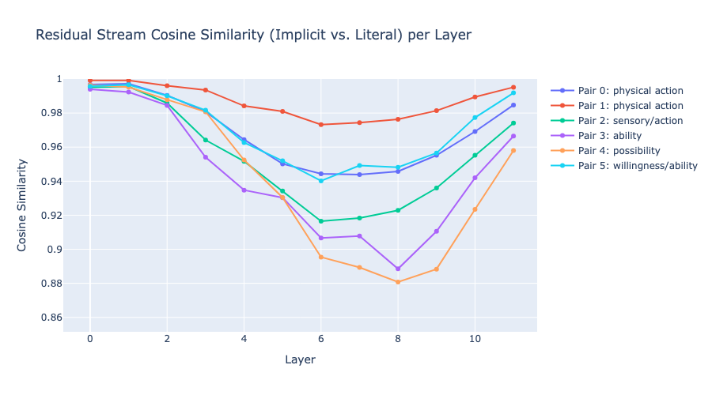

# Implicit Meaning in GPT-2: A Mechanistic Interpretability Analysis

## Research Question

How does GPT-2-small internally distinguish between **implicit meaning** (indirect requests like *"Can you pass the salt?"*) and **literal meaning** (genuine ability questions like *"Can you lift this rock?"*)?

These sentences share nearly identical syntactic structure ("Can you + VERB + OBJECT + ?") but carry fundamentally different pragmatic intent. Humans effortlessly distinguish them — nobody answers "Can you pass the salt?" with "Yes, I can" and then sits there. This project investigates **where and how** this distinction emerges inside a transformer.

## Motivation

Understanding how language models process pragmatic meaning is safety-relevant: a model that "reads between the lines" in ways we don't understand could also manipulate in ways we can't detect. This project is also motivated by connections to **Bayesian level-k thinking** in game theory, where agents recursively model others' beliefs ("I think that you think that I think...") — a formal framework that maps onto the recursive social reasoning involved in pragmatic language understanding.

## Methods

Using [TransformerLens](https://github.com/TransformerLensOrg/TransformerLens) on GPT-2-small (12 layers, 12 heads, 768-dim), we apply five complementary analysis techniques to 6 matched sentence pairs:

| Method | What it measures |
|--------|-----------------|
| **Logit Lens** | What token the model "wants to predict" at each layer |
| **Probe Token Tracking** | Layer-by-layer probability of specific response tokens (Yes/No/Sure) |
| **Attention Pattern Analysis** | Which tokens the final position attends to, per head and layer |
| **Residual Stream Cosine Similarity** | How similar the internal representations of implicit vs. literal sentences are at each layer |
| **Activation Patching** | Causal intervention — replacing implicit activations with literal ones to identify critical layers |

## Key Findings

### 1. Pragmatic divergence emerges in layers 5-8

Early layers (0-4) process both sentence types identically, producing generic predictions ("What"). Starting at layer 5, predictions diverge: literal questions shift toward Yes/No tokens, while implicit requests produce compliance-related tokens ("Answer", "Please", "Well").


### 2. Literal questions activate a Yes/No pathway; implicit requests do not

Tracking probe token probabilities across layers reveals that literal questions trigger P("Yes") up to 0.51 at layer 9. Implicit requests show no comparable Yes/No signal — consistent with how humans respond to indirect requests (with action, not with "Yes").

### 3. Attention encodes pragmatic intent, not just syntax

At layer 9, the final token ("?") in implicit requests primarily attends to **"Can" + object noun** (the request pattern), while in literal questions it attends more to **"you"** (the subject whose ability is being evaluated). Despite identical syntactic structure, the model allocates attention based on pragmatic function.

### 4. Internal representations diverge maximally at layers 6-8

Cosine similarity between implicit and literal residual streams drops from ~0.99 (layer 0) to ~0.88 (layers 6-8), then recovers as both converge on formatting tokens in final layers. This U-shaped pattern is consistent across all 6 sentence pairs.



### 5. Layer 5 is a causal bottleneck

Activation patching — replacing the implicit sentence's residual stream with the literal sentence's at each layer — shows the largest effect at layer 5, confirming it as a causal bottleneck for the pragmatic distinction.

## Summary

Three independent analysis methods (logit lens, attention patterns, cosine similarity) and one causal intervention (activation patching) converge on the same conclusion: **GPT-2-small distinguishes implicit from literal meaning in layers 5-8**, using qualitatively different processing strategies:

- **Implicit requests** → pattern recognition + global context (attend to sentence frame and object)
- **Literal questions** → compositional semantic analysis (attend to subject, verb, and object to evaluate ability)

## Limitations

- Small model (124M params) with limited pragmatic capability
- Small stimulus set (6 pairs); lexical confounds between pairs
- Mean attention averaging dilutes head-specific effects

## Next Steps

- Per-head activation patching to identify specific "pragmatic processing" heads
- Replication on larger models (GPT-2-medium, Pythia)
- Broader pragmatic phenomena (sarcasm, implicature, irony)
- Connection to theory-of-mind tasks and level-k reasoning frameworks

## Setup

```bash
pip install transformer-lens torch numpy matplotlib plotly jupyter circuitsvis pandas
```

```bash
jupyter notebook experiment.ipynb
```

## Author

Yi Guo — PhD in Statistics (Duke University). Research interests in mechanistic interpretability, Bayesian inference, and the internal representation of pragmatic reasoning in large language models.

## References

- Elhage et al. (2021). "A Mathematical Framework for Transformer Circuits." Anthropic.
- nostalgebraist (2020). "Interpreting GPT: The Logit Lens." LessWrong.
- Olsson et al. (2022). "In-context Learning and Induction Heads." Anthropic.
