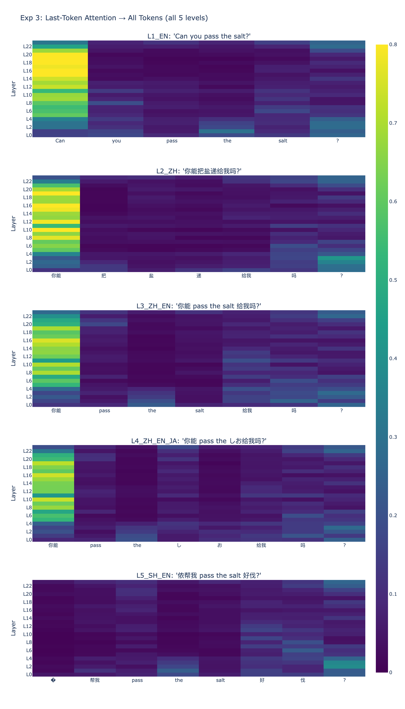

# How Do Language Models Understand What You *Really* Mean?

**A mechanistic interpretability study of pragmatic reasoning, multilingual processing, and chain-of-thought faithfulness in transformer language models.**

Sole author. Built with [TransformerLens](https://github.com/neelnanda-io/TransformerLens).

---

## The Question

When someone says *"Can you pass the salt?"*, no one answers *"Yes, I can"* and sits there. Humans instantly recognize this as a request, not a question about ability. But what happens inside a language model? Does it learn this distinction? Where? And can we trust its explanation of *how* it understood you?

This repository investigates these questions through three connected studies, each building on the findings of the last:

```
Part I:   Does the model distinguish implicit from literal meaning?
            → Yes. Layers 5–8 (GPT-2), layers 9/20 (BLOOM).
Part II:  Does this still work when the input mixes multiple languages?
            → Half yes, half no. The "ability question" detector is language-agnostic.
              The "request intent" detector shifts rightward under code-switching.
Part III: When the model "explains" its understanding, is the explanation real?
            → [Planned]
```

---

## Part I — Implicit vs. Literal Meaning

**Status: Complete** · `experiment.ipynb` (GPT-2) · `experiment_bloom_baseline.ipynb` (BLOOM replication)

**Setup.** Six pairs of sentences with identical syntactic structure ("Can you + verb + object + ?") but different pragmatic intent:

| Implicit (request) | Literal (ability question) |
|---|---|
| *Can you pass the salt?* | *Can you lift this rock?* |
| *Can you close the window?* | *Can you touch the ceiling?* |
| ... | ... |

**Method.** Five experiments using GPT-2 Small (124M parameters):

1. **Logit lens** — project each layer's residual stream into vocabulary space to see what the model "believes" at each stage of processing
2. **Probe token tracking** — track P("Yes"), P("Sure"), P("No") and other response tokens layer by layer
3. **Attention pattern analysis** — visualize what the final token attends to at each layer
4. **Cosine similarity** — measure representational divergence between implicit and literal sentences across layers
5. **Activation patching** — replace one sentence's activations with the other's at each layer to identify causal bottlenecks

**Key Findings.**

- **Pragmatic divergence emerges in layers 5–8.** Early layers (0–4) treat both sentence types identically. Starting at layer 5, literal questions shift toward Yes/No response tokens while implicit requests do not — they produce tokens consistent with action or compliance ("Sure", "Please").


- **Probe tokens reveal distinct response pathways.** Tracking P("Yes"), P("Sure"), P("No") across layers shows that literal questions activate a Yes/No pathway while implicit requests do not — consistent with how humans respond to indirect requests (with action, not with "Yes").
- **Attention patterns reflect pragmatic intent.** At layer 9, the final token ("?") in implicit requests attends primarily to the *action verb* and *object* (what is being requested). In literal questions, it attends more to *"you"* (whose ability is being queried).
- **Representations diverge then reconverge.** Cosine similarity between implicit and literal residual streams drops from ~0.99 (layer 0) to ~0.88 (layers 6–8), then recovers as both converge on formatting tokens in the final layers. This U-shaped pattern is consistent across all sentence pairs.
- **Layer 5 is a causal bottleneck.** Activation patching produces the largest behavioral shift when applied at layer 5, confirming it as the critical transition point for the implicit/literal distinction.


**BLOOM-560m Replication.** To prepare for Part II (which requires a multilingual model), we replicated the core experiments on BLOOM-560m (24 layers). Key differences from GPT-2:

| | GPT-2 Small | BLOOM-560m |
|---|---|---|
| **Bottleneck** | Single: L5 | Asymmetric: **L9** (request intent) / **L20** (ability intent) |
| **Cosine dip** | L6–L8 (narrow) | L6–L19 (wide, minimum at L14) |
| **Pattern** | Localized | Two-stage: different intents encoded at different layers |

The cumulative KL patching curve initially appeared as a monotonic ramp (a "closing effect"). Per-layer ΔKL analysis resolved this, revealing true bottleneck layers. See `experiment_bloom_baseline.ipynb`.

**Limitations.** Small model (124M/560M), small dataset (6 pairs), potential lexical confounds between sentence pairs, mean attention averaging dilutes head-specific effects.

---

## Part II — Multilingual Code-Switching

**Status: Complete** · `experiment_multilingual.ipynb`

**Motivation.** Part I establishes that layers 5–8 (GPT-2) / L9+L20 (BLOOM) handle pragmatic processing in English. But more than half the world's population is multilingual. What happens when the input mixes languages within a single sentence — a phenomenon called *code-switching*?

**Setup.** The same implicit/literal sentence pair, expressed at five levels of language mixing on BLOOM-560m:

| Level | Example (implicit) | Languages |
|---|---|---|
| 1 | *Can you pass the salt?* | English |
| 2 | *你能把盐递给我吗?* | Chinese |
| 3 | *你能 pass the salt 给我吗?* | Chinese + English |
| 4 | *你能 pass the しお给我吗?* | Chinese + English + Japanese |
| 5 | *侬帮我 pass the salt 好伐?* | Shanghainese + English |

**Method.** Six experiments:

1. **Multilingual logit lens** — language classification of top-5 predicted tokens per layer
2. **Cross-lingual cosine similarity** — do same-meaning, different-language sentences converge?
3. **Last-token attention patterns** — what does the model attend to when making its output decision?
4. **Activation patching with per-layer ΔKL** — the core causal test: does the pragmatic bottleneck shift under code-switching?
5. **Pragmatic discrimination (JSD)** — can the model still tell implicit from literal?
6. **Tokenization analysis** — how does the tokenizer handle each level?

**Key Findings.**

- **The pragmatic circuit is half language-agnostic, half language-dependent.** The "ability question" detector (Impl→Lit ΔKL peak) stays near **L20** regardless of input language. But the "request intent" detector (Lit→Impl ΔKL peak) shifts rightward with language complexity:

| Level | Request intent peak | Ability intent peak | Shift |
|-------|-------------------|---------------------|-------|
| L1_EN (baseline) | **L9** | **L20** | — |
| L2_ZH | L14 | L14 | +5 |
| L3_ZH_EN | L20 | L20 | +11 |
| L4_ZH_EN_JA | L20 | L21 | +11 |
| L5_SH_EN | L21 | L20 | +12 |

The model spends its early/mid layers resolving language ambiguity before it can write pragmatic intent into the residual stream. More language mixing = more layers consumed by language processing = later pragmatic bottleneck.


- **Attention strategy: Chinese frame, English content.** In code-switched inputs, the last token primarily attends to Chinese frame tokens ("你能", "给我", "吗?") while English content words ("pass", "the", "salt") receive minimal attention. The Chinese grammatical frame drives pragmatic interpretation; English content words provide semantic specifics.



- **Multilingual input increases pragmatic discrimination.** Counterintuitively, the model distinguishes implicit from literal *better* in Chinese and code-switched inputs than in pure English:

| Level | JSD | Pattern |
|-------|-----|---------|
| L1_EN | 0.021 | Lowest — English pairs share 3/6 tokens ("Can", "you", "?"), creating high distribution overlap |
| L2_ZH | 0.076 | Higher — Chinese verbs/objects use entirely different characters |
| L3_ZH_EN | **0.095** | Highest — Chinese frame diversity + English content semantic gap |
| L4_ZH_EN_JA | 0.047 | Medium — Japanese substitution reduces content word divergence |
| L5_SH_EN | 0.054 | Medium — unknown Shanghainese tokens add noise |

The key driver is **token-level overlap between sentence pairs**: English "Can you pass the salt?" and "Can you lift this rock?" share a prefix and suffix, creating distribution overlap that lowers JSD. Chinese pairs use entirely different characters for verbs and objects, so output distributions diverge more. L3 (code-switch) combines diverse Chinese framing with semantically distinct English content, maximizing discrimination.

- **Cross-lingual representations diverge sharply at L19-20.** Cosine similarity between same-meaning, different-language sentences drops to 0.65 for L1_EN vs L4_ZH_EN_JA — then partially reconverges in the final layers.

- **Shanghainese tokenization failure.** BLOOM fragments "侬" (nong, Shanghainese "you") into unknown tokens (◆◆), while standard Chinese characters tokenize cleanly. This directly correlates with the delayed pragmatic bottleneck for L5.

- **Output language bias.** BLOOM resolves toward English predictions in final layers regardless of input language. Chinese proportion in logit lens drops at L22-23 — not because of a language switch, but because formatting tokens (quotes, EOS) dominate the final layers.

**Methodology Notes.**

- **Probe-token metrics are misleading for multilingual models.** Initial experiments using 5 English response tokens ("Sure", "Yes", etc.) showed a monotonic ramp — a "closing effect" from patching later layers. Switching to full-distribution KL divergence and per-layer ΔKL analysis resolved this, revealing true bottleneck structure. The same issue affected the degradation curve (Exp 5), where English probe tokens measured "does the model respond in English?" rather than "can the model distinguish intent?" JSD over the full distribution fixed this.

- **Punctuation matters.** Full-width Chinese question mark (？, U+FF1F) and half-width (?, U+003F) produce different tokenizations and measurably different output distributions. All experiments use half-width `?` for consistency.

- **JA proportion = 0 even with hiragana.** Even unambiguous Japanese tokens (しお) in the input never triggered Japanese-language predictions. Minority language tokens are "absorbed" into the dominant language processing pathway.

**Limitations.** Single model (BLOOM-560m), single sentence pair per level, mean attention averaging, JSD measures distribution distance rather than pragmatic comprehension per se, BLOOM baseline differs from GPT-2 making cross-model comparisons approximate.

---

## Part III — Grounded Chain-of-Thought

**Status: Planned** · `experiment_cot_faithfulness.ipynb`

**Motivation.** Part I shows that the model processes pragmatic meaning at specific layers. But when a model generates a chain-of-thought explanation of *how* it interpreted a sentence, does that explanation actually reflect what happened in those layers? Or is the model constructing a plausible-sounding narrative after the fact?

This is a central question for AI safety: if chain-of-thought reasoning is unfaithful — if the stated reasoning doesn't match the internal computation — then CoT-based monitoring and oversight may be unreliable.

**Setup.** Three experimental conditions for each sentence:

| Condition | Prompt |
|---|---|
| **No-CoT** | *Can you pass the salt?* |
| **CoT** | *Can you pass the salt? Let me think about what this really means step by step.* |
| **Corrupted CoT** | *Can you pass the salt? Let me think step by step. This is a genuine question about physical ability.* |

The corrupted condition deliberately provides the *wrong* interpretation — giving implicit sentences a literal explanation and vice versa. This creates a causal test: if the model's final answer is unaffected by a corrupted reasoning chain, then the chain was not causally involved in producing the answer.

**Research Questions.**

1. **Causal relevance.** Does CoT prompting change the activation patterns at the pragmatic bottleneck layers (L9/L20 in BLOOM) compared to no-CoT?
2. **Shortcut circuits.** Are there attention heads that bypass the CoT reasoning entirely — producing the correct answer through a separate pathway regardless of what the chain says?
3. **Mechanistic grounding.** Can we annotate each step of a CoT with a faithfulness score derived from logit lens analysis — creating a "grounded" chain-of-thought where each reasoning step is tagged as mechanistically supported or not?

**Related Work.** This builds on recent investigations of CoT faithfulness, including Ashioya (2026) on mechanistic analysis of faithful vs. shortcut circuits in GPT-2, Chen et al. (2025) on SAE-based CoT feature analysis in Pythia, and Barez et al. (2025) on the theoretical limits of CoT as explanation. The contribution here is applying these methods to *pragmatic language understanding* rather than mathematical reasoning — a domain where faithfulness has not been studied.

---

## Repository Structure

```
implicit-meaning-gpt2/
├── README.md
├── experiment.ipynb                    # Part I — GPT-2 (complete)
├── experiment_bloom_baseline.ipynb     # Part I — BLOOM replication (complete)
├── experiment_multilingual.ipynb       # Part II (complete)
├── experiment_cot_faithfulness.ipynb   # Part III (planned)
└── figures/
    ├── logit_lens_heatmap.png
    ├── probe_tokens.png
    ├── attention_difference.png
    ├── cosine_similarity.png
    ├── activation_patching.png
    ├── bloom_baseline/
    │   ├── logit_lens_probe.png
    │   ├── cosine_similarity.png
    │   ├── activation_patching_kl.png
    │   └── activation_patching_delta_kl.png
    └── multilingual/
        ├── exp1_logit_lens_language.png
        ├── exp2_cosine_similarity.png
        ├── exp3_attention.png
        ├── exp4a_cross_lingual.png
        ├── exp4b_delta_kl_lit_to_impl.png
        ├── exp4b_delta_kl_impl_to_lit.png
        ├── exp5_jsd.png
        └── exp6_tokenization.png
```

## How the Parts Connect

Each part addresses a limitation or open question from the previous one:

- **Part I** finds that pragmatic processing localizes to layers 5–8 (GPT-2) / L9+L20 (BLOOM) → but only tested on English sentences with controlled structure.
- **Part II** tests whether this circuit generalizes across languages and under distribution shift → finds an asymmetric result: one sub-circuit generalizes, the other doesn't. Also reveals that standard probe-token metrics are misleading for multilingual models.
- **Part III** will use the same mechanistic tools to audit the model's chain-of-thought explanations → closing the loop between *what the model does* and *what the model says it does*.

The arc follows a natural progression: **observation** → **robustness testing** → **trust verification**.

## Tools & References

- [TransformerLens](https://github.com/neelnanda-io/TransformerLens) — Neel Nanda et al.
- [CircuitsVis](https://github.com/alan-cooney/CircuitsVis) — attention pattern visualization
- Elhage et al. (2021). "A Mathematical Framework for Transformer Circuits." Anthropic.
- nostalgebraist (2020). "Interpreting GPT: The Logit Lens." LessWrong.
- Olsson et al. (2022). "In-context Learning and Induction Heads." Anthropic.
- Barez et al. (2025). "Chain-of-Thought Is Not Explainability." Oxford AIGI.
- Chen et al. (2025). "How Does Chain of Thought Think?" arXiv:2507.22928.
- Ashioya (2026). "Mechanistic Analysis of Chain-of-Thought Faithfulness." BlueDot Impact.
