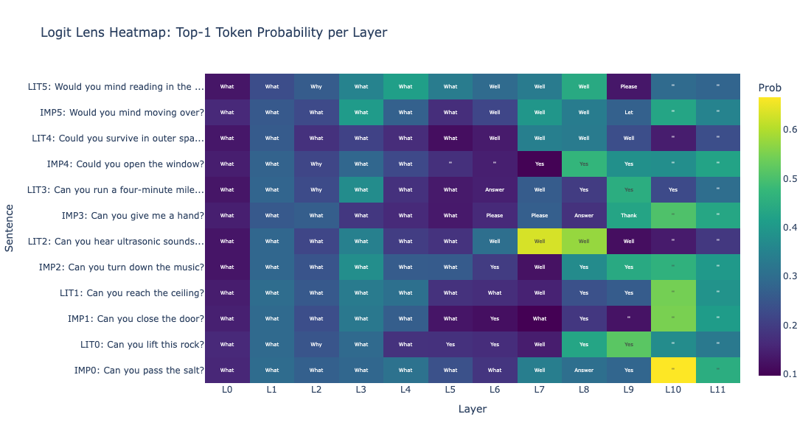
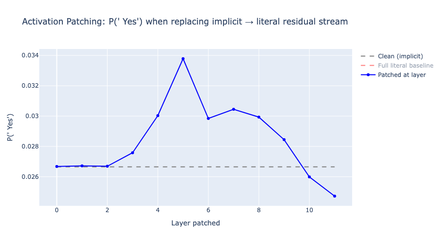

# How Do Language Models Understand What You *Really* Mean?

**A mechanistic interpretability study of pragmatic reasoning, multilingual processing, and chain-of-thought faithfulness in transformer language models.**

Sole author. Built with [TransformerLens](https://github.com/neelnanda-io/TransformerLens).

---

## The Question

When someone says *"Can you pass the salt?"*, no one answers *"Yes, I can"* and sits there. Humans instantly recognize this as a request, not a question about ability. But what happens inside a language model? Does it learn this distinction? Where? And can we trust its explanation of *how* it understood you?

This repository investigates these questions through three connected studies, each building on the findings of the last:

```
Part I:   Does the model distinguish implicit from literal meaning?
            → Yes. Layers 5–8.
Part II:  Does this still work when the input mixes multiple languages?
            → [In progress]
Part III: When the model "explains" its understanding, is the explanation real?
            → [Planned]
```

---

## Part I — Implicit vs. Literal Meaning

**Status: Complete** · `experiment.ipynb`

**Setup.** Six pairs of sentences with identical syntactic structure ("Can you + verb + object + ?") but different pragmatic intent:

| Implicit (request) | Literal (ability question) |
|---|---|
| *Can you pass the salt?* | *Can you lift this rock?* |
| *Can you close the window?* | *Can you touch the ceiling?* |
| ... | ... |

**Method.** Five experiments using GPT-2 Small (124M parameters):

1. **Logit lens** — project each layer's residual stream into vocabulary space to see what the model "believes" at each stage of processing
2. **Probe token tracking** — track P("Yes"), P("Sure"), P("No") and other response tokens layer by layer
3. **Attention pattern analysis** — visualize what the final token attends to at each layer
4. **Cosine similarity** — measure representational divergence between implicit and literal sentences across layers
5. **Activation patching** — replace one sentence's activations with the other's at each layer to identify causal bottlenecks

**Key Findings.**

- **Pragmatic divergence emerges in layers 5–8.** Early layers (0–4) treat both sentence types identically. Starting at layer 5, literal questions shift toward Yes/No response tokens while implicit requests do not — they produce tokens consistent with action or compliance ("Sure", "Please").



- **Probe tokens reveal distinct response pathways.** Tracking P("Yes"), P("Sure"), P("No") across layers shows that literal questions activate a Yes/No pathway while implicit requests do not — consistent with how humans respond to indirect requests (with action, not with "Yes").
- **Attention patterns reflect pragmatic intent.** At layer 9, the final token ("?") in implicit requests attends primarily to the *action verb* and *object* (what is being requested). In literal questions, it attends more to *"you"* (whose ability is being queried).
- **Representations diverge then reconverge.** Cosine similarity between implicit and literal residual streams drops from ~0.99 (layer 0) to ~0.88 (layers 6–8), then recovers as both converge on formatting tokens in the final layers. This U-shaped pattern is consistent across all sentence pairs.
- **Layer 5 is a causal bottleneck.** Activation patching produces the largest behavioral shift when applied at layer 5, confirming it as the critical transition point for the implicit/literal distinction.



**Limitations.** Small model (124M), small dataset (6 pairs), potential lexical confounds between sentence pairs, mean attention averaging dilutes head-specific effects.

---

## Part II — Multilingual Code-Switching

**Status: In progress** · `experiment_multilingual.ipynb`

**Motivation.** Part I establishes that layers 5–8 handle pragmatic processing in English. But more than half the world's population is multilingual. What happens when the input mixes languages within a single sentence — a phenomenon called *code-switching*?

**Setup.** The same implicit/literal sentence pairs, expressed at five levels of language mixing:

| Level | Example (implicit) | Languages |
|---|---|---|
| 1 | *Can you pass the salt?* | English |
| 2 | *你能把盐递给我吗？* | Chinese |
| 3 | *你能 pass the salt 给我吗？* | Chinese + English |
| 4 | *你能 pass the 塩给我吗？* | Chinese + English + Japanese |
| 5 | *侬帮我 pass the salt 好伐？* | Shanghainese + English |

Level 5 is particularly interesting: Shanghainese is a low-resource dialect with minimal representation in training data.

**Research Questions.**

1. **Language processing.** At which layers does the model "recognize" that the input contains multiple languages? Are there attention heads specialized for language identification?
2. **Output language selection.** How does the model determine which language to respond in? Where does this decision occur?
3. **Degradation under scarcity.** Does pragmatic processing (the layer 5–8 circuit from Part I) degrade as the input moves further from the training distribution?
4. **Cross-lingual transfer.** Can the pragmatic circuit trained on English still function when the input is multilingual? If so, this suggests the circuit encodes *meaning* rather than *language-specific patterns*, with implications for reducing multilingual training costs.

**Planned Experiments.**

- Multilingual logit lens with language-classified token predictions
- Cross-lingual cosine similarity (same meaning, different languages — do representations converge?)
- Attention analysis at language switch boundaries (e.g., the transition from 你能 → pass)
- Cross-lingual activation patching (English → mixed, mixed → English)
- Performance degradation quantification across levels 1–5
- Tokenization analysis for Shanghainese (how does GPT-2's tokenizer handle 侬, 好伐, etc.?)

---

## Part III — Grounded Chain-of-Thought

**Status: Planned** · `experiment_cot_faithfulness.ipynb`

**Motivation.** Part I shows that the model processes pragmatic meaning in layers 5–8. But when a model generates a chain-of-thought explanation of *how* it interpreted a sentence, does that explanation actually reflect what happened in those layers? Or is the model constructing a plausible-sounding narrative after the fact?

This is a central question for AI safety: if chain-of-thought reasoning is unfaithful — if the stated reasoning doesn't match the internal computation — then CoT-based monitoring and oversight may be unreliable.

**Setup.** Three experimental conditions for each sentence:

| Condition | Prompt |
|---|---|
| **No-CoT** | *Can you pass the salt?* |
| **CoT** | *Can you pass the salt? Let me think about what this really means step by step.* |
| **Corrupted CoT** | *Can you pass the salt? Let me think step by step. This is a genuine question about physical ability.* |

The corrupted condition deliberately provides the *wrong* interpretation — giving implicit sentences a literal explanation and vice versa. This creates a causal test: if the model's final answer is unaffected by a corrupted reasoning chain, then the chain was not causally involved in producing the answer.

**Research Questions.**

1. **Causal relevance.** Does CoT prompting change the activation patterns in layers 5–8 compared to no-CoT? If so, the reasoning chain is influencing the computation that matters for pragmatic understanding.
2. **Shortcut circuits.** Are there attention heads that bypass the CoT reasoning entirely — producing the correct answer through a separate pathway regardless of what the chain says?
3. **Mechanistic grounding.** Can we annotate each step of a CoT with a faithfulness score derived from logit lens analysis — creating a "grounded" chain-of-thought where each reasoning step is tagged as mechanistically supported or not?

**Planned Experiments.**

- CoT vs. no-CoT logit lens comparison (do layer 5–8 predictions differ?)
- Corrupted CoT causal test (four possible outcomes: answer changes + layers change = faithful; answer unchanged + layers unchanged = unfaithful; and two intermediate cases)
- Cross-condition activation patching (which layers carry CoT-specific information?)
- CoT vs. no-CoT cosine similarity curves (does CoT change internal representations, or only surface output?)
- Grounded CoT prototype: per-step faithfulness annotation using logit lens (bonus)

**Related Work.** This builds on recent investigations of CoT faithfulness, including Ashioya (2026) on mechanistic analysis of faithful vs. shortcut circuits in GPT-2, Chen et al. (2025) on SAE-based CoT feature analysis in Pythia, and Barez et al. (2025) on the theoretical limits of CoT as explanation. The contribution here is applying these methods to *pragmatic language understanding* rather than mathematical reasoning — a domain where faithfulness has not been studied.

---

## Repository Structure

```
implicit-meaning-gpt2/
├── README.md
├── experiment.ipynb                    # Part I  (complete)
├── experiment_multilingual.ipynb       # Part II (in progress)
├── experiment_cot_faithfulness.ipynb   # Part III (planned)
└── figures/
    ├── logit_lens_heatmap.png
    ├── probe_tokens.png
    ├── attention_difference.png
    ├── cosine_similarity.png
    └── activation_patching.png
```

## How the Parts Connect

Each part addresses a limitation or open question from the previous one:

- **Part I** finds that pragmatic processing localizes to layers 5–8 → but only tested on English sentences with controlled structure.
- **Part II** tests whether this circuit generalizes across languages and under distribution shift → but doesn't address whether the model's *self-reported* understanding matches its internal processing.
- **Part III** uses the same mechanistic tools to audit the model's chain-of-thought explanations → closing the loop between *what the model does* and *what the model says it does*.

The arc follows a natural progression: **observation** → **robustness testing** → **trust verification**.

## Tools & References

- [TransformerLens](https://github.com/neelnanda-io/TransformerLens) — Neel Nanda et al.
- [CircuitsVis](https://github.com/alan-cooney/CircuitsVis) — attention pattern visualization
- Elhage et al. (2021). "A Mathematical Framework for Transformer Circuits." Anthropic.
- nostalgebraist (2020). "Interpreting GPT: The Logit Lens." LessWrong.
- Olsson et al. (2022). "In-context Learning and Induction Heads." Anthropic.
- Barez et al. (2025). "Chain-of-Thought Is Not Explainability." Oxford AIGI.
- Chen et al. (2025). "How Does Chain of Thought Think?" arXiv:2507.22928.
- Ashioya (2026). "Mechanistic Analysis of Chain-of-Thought Faithfulness." BlueDot Impact.
